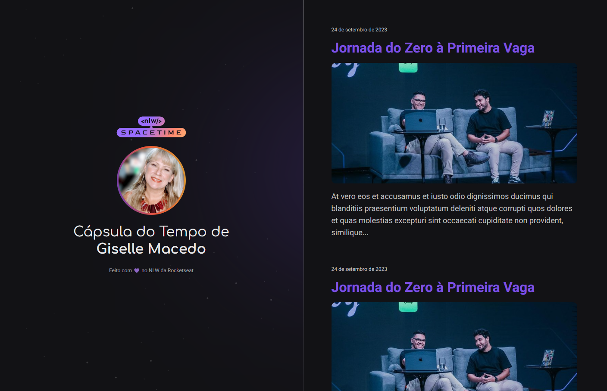

# NLW Spacetime

### Projeto Desenvolvido durante o evento NLW Spacetime da Rocketseat.

 

  
  

> Trilha Explorer

 

## 💻 Projeto

Aplicação de recordação de memórias, onde o usuário poderá adicionar à uma timeline textos, fotos e vídeos de acontecimentos marcantes da sua vida, organizados por mês e ano.
 

## 🚀 Recursos Utilizados

- Variáveis CSS
- utilização do selector Webkit para customizar a scrollbar
- Estilização usando display flex e grid
- Efeito de hover na imagem, com transição suave
- Criação de animação de entrada com Keyframe
- Layout responsivo, utilizando fontes responsivas e media query
   

## 🚀 Tecnologias

Esse projeto foi desenvolvido com as seguintes tecnologias:

- HTML
- CSS
- Git e Github

 

## Contato: gisellemacedo.dev@gmail.com

 

 
 

<h3 align="center">Feito com 💜 by Giselle</h3>
